# Figures and Tables

Panex Privus writes analysis outputs as machine-readable tables and metadata.
Those tables are the analysis record. Reports and plots are interpretive
summaries generated from those tables so you can explain target-private signal,
VCF/GFA agreement, read-level support, annotations, landscape patterns, and
pangenome structure in a manuscript, report, or slide deck.

The default workflow is now table-first:

1. run an analysis command such as `privy scan`, `privy pangenome`, or
   `privy landscape`
2. inspect or archive the TSV/JSON outputs
3. render figures afterwards with `privy plot --plot-set ...`

`privy pangenome` and `privy landscape` still accept `--plots` for one-command
figure generation, but the separate `privy plot` step is recommended for large
runs and for publication formats such as `svg` or `pdf`.

Each command section below stands on its own. For publication use, prefer to
report the command, input representation, target/off-target definitions, major
thresholds, and software version or commit.

## `privy scan`

`privy scan` is the discovery step. It asks which VCF alleles or GFA graph
segments are present in the target cohort and absent from off-target genomes.
Its tables are the foundation for the rest of the workflow.

Example command:

```bash
privy scan \
  --vcf variants.vcf.gz \
  --targets T1 T2 \
  --off-targets O1 O2 O3 \
  --outdir results/
```

### Table: Ranked Candidate Loci (`hits.tsv`)

| locus_id | contig | start | end | variant_type | allele_key | target_support_n | offtarget_support_n | strictness_class | final_score |
|----------|--------|-------|-----|--------------|------------|------------------|---------------------|------------------|-------------|
| `PPX00000001` | `chr1` | 99 | 100 | `snp` | `chr1:100:A:T` | 2 | 0 | `strict_complete` | 1.283333 |
| `PPX00000003` | `chr1` | 299 | 300 | `snp` | `chr1:300:A:T` | 2 | 0 | `strict_offtarget_missing` | 1.003333 |
| `PPX00000004` | `chr1` | 399 | 400 | `snp` | `chr1:400:A:T` | 1 | 0 | `strict_both_missing` | 0.843333 |

**Table title.** Ranked target-private candidate loci.

**Caption.** Candidate private loci discovered from a multisample VCF. Intervals
use 0-based half-open coordinates. Support and missingness are reported
separately so biological absence is not conflated with missing or uninformative
data. Rows are sorted by `final_score`.

### Table: Candidate Regions (`regions.tsv`)

| region_id | contig | start | end | n_loci | variant_types | dominant_strictness_class | target_consistency | offtarget_exclusion | final_score |
|-----------|--------|-------|-----|--------|---------------|---------------------------|--------------------|---------------------|-------------|
| `REGION000000` | `chr1` | 99 | 100 | 1 | `snp` | `strict_complete` | 1.0 | 1.0 | 1.283333 |
| `REGION000001` | `chr1` | 199 | 200 | 1 | `snp` | `strict_target_missing` | 0.0 | 1.0 | 0.923333 |

**Table title.** Merged candidate private regions.

**Caption.** Candidate regions produced by merging nearby passing loci. Each row
summarizes the number of constituent loci, dominant strictness class, target
consistency, off-target exclusion, and ranking score for a candidate interval.

### Table: Evidence Records (`evidence.tsv`)

| locus_id | source_type | evidence_class | metric_name | metric_value | details |
|----------|-------------|----------------|-------------|--------------|---------|
| `PPX00000001` | `vcf` | `support` | `allele_pattern` | 1.283333 | all targets support; all off-targets confidently absent |
| `PPX00000002` | `vcf` | `support` | `allele_pattern` | 0.923333 | passes with missingness |

**Table title.** Evidence supporting candidate private loci.

**Caption.** Per-locus evidence records emitted during scanning. VCF and GFA
records describe the discovery evidence; optional BAM records add read-level
support, absence, ambiguity, or contradiction.

### Table: Per-Sample Support (`sample_support.tsv`)

| locus_id | sample_id | cohort_role | genotype | allele_supported | evidence_class |
|----------|-----------|-------------|----------|------------------|----------------|
| `PPX00000001` | `T1` | `target` | `0/1` | `true` | `support` |
| `PPX00000001` | `T2` | `target` | `0/1` | `true` | `support` |
| `PPX00000001` | `O1` | `off_target` | `0/0` | `false` | `absence` |

**Table title.** Sample-level support for private-locus candidates.

**Caption.** Genotype and evidence state for each sample at each candidate
locus. This table is useful for auditing candidate calls, explaining missingness,
and selecting loci for follow-up validation.

### Table: GFA Graph Segments (`graph_segments.tsv`)

| locus_id | segment_name | segment_length | segment_length_class | graph_signal_type | offtarget_coordinate_covered_n | interpretation |
|----------|--------------|----------------|----------------------|-------------------|-------------------------------|----------------|
| `GPX00000001` | `s2_target` | 10 | `small_indel_like` | `target_traversed_graph_segment` | 3 | Targets traverse this graph segment; off-targets have coordinate-overlapping graph coverage but do not traverse this same segment. |

**Table title.** GFA private graph-node evidence.

**Caption.** GFA-specific companion table for `hits.tsv`. Each row describes a
coordinate-tagged graph segment traversed by target samples and not traversed by
off-target samples. Segment length classes are descriptive graph-node size
classes; they should not be treated as VCF variant calls without additional
path or bubble analysis.

### Table: Scan Metrics (`qc.tsv`)

| metric | value | description |
|--------|-------|-------------|
| `records_evaluated` | 9 | Total VCF records processed |
| `alleles_passed` | 7 | Alleles passing discovery criteria |
| `alleles_contradicted` | 1 | Alleles where off-targets also carry the allele |
| `loci_emitted` | 7 | Loci written to `hits.tsv` |

**Table title.** Scan quality-control summary.

**Caption.** Run-level counts for evaluated records, filtered records, passing
alleles, contradicted alleles, emitted loci, and merged regions. Include these
metrics in methods or supplements to make filtering and discovery yield clear.

## `privy pangenome`

`privy pangenome` describes the full pangenome and the target/off-target
sub-pangenomes. It complements `privy scan`: scan finds candidate private loci,
while pangenome analysis describes the feature space those candidates come from.

Example commands:

```bash
privy pangenome \
  --gfa tests/data/small_cohort.gfa \
  --targets T1 T2 \
  --permutations 25 \
  --outdir docs/assets/examples/pangenome-gfa

privy pangenome \
  --vcf tests/data/small_cohort.vcf \
  --targets T1 T2 \
  --permutations 25 \
  --outdir docs/assets/examples/pangenome-vcf
```

In both examples, `T1` and `T2` are target samples. Because no off-targets are
specified, every other sample in the input becomes off-target.

The pangenome command writes tables by default. Render pangenome figures from
an existing result directory with the `pangenome` plot set:

```bash
privy plot \
  --plot-set pangenome \
  --input-dir docs/assets/examples/pangenome-gfa \
  --output-format png
```

### Table: Feature Summary (`feature_summary.tsv`)

| feature_id | source_type | feature_type | total_present_n | target_present_n | offtarget_present_n | target_category | offtarget_category | target_private |
|------------|-------------|--------------|-----------------|------------------|---------------------|-----------------|--------------------|----------------|
| `s1` | `gfa` | `segment` | 5 | 2 | 3 | `core` | `core` | `False` |
| `s2_target` | `gfa` | `segment` | 2 | 2 | 0 | `core` | `absent` | `True` |
| `s4_target` | `gfa` | `segment` | 1 | 1 | 0 | `private` | `absent` | `True` |
| `chr1:100:A:T` | `vcf` | `snp` | 2 | 2 | 0 | `core` | `absent` | `True` |

**Table title.** Pangenome feature presence by cohort.

**Caption.** Feature-level pangenome summary. For GFA input, each feature is a
graph segment; for VCF input, each feature is an alternate allele. Categories
are assigned independently for the full, target, and off-target groups.

### Table: Coverage Histogram (`coverage_histogram.tsv`)

| group | coverage | n_features | n_bp |
|-------|----------|------------|------|
| `full` | 1 | 1 | 7 |
| `full` | 2 | 1 | 10 |
| `full` | 3 | 2 | 17 |
| `full` | 5 | 2 | 16 |

**Table title.** Feature coverage histogram.

**Caption.** Number of features and total feature bp observed at each sample
coverage level. This table supports coverage-distribution plots and helps
separate singleton-rich datasets from datasets dominated by shared features.

### Table: Composition (`composition.tsv`)

| group | category | n_features | n_bp |
|-------|----------|------------|------|
| `full` | `private` | 1 | 7 |
| `full` | `accessory` | 4 | 35 |
| `full` | `core` | 2 | 16 |
| `target` | `core` | 3 | 26 |

**Table title.** Pangenome composition by group.

**Caption.** Core, accessory, private, and absent feature counts for the full,
target, and off-target groups. A feature can be target-core and off-target-absent,
which is the strongest pangenome-level pattern for target-private signal.

### Table: Growth Curves (`growth_curves.tsv`)

| group | trial | n | sample_added | features | new_features | singleton_features |
|-------|-------|---|--------------|----------|--------------|--------------------|
| `full` | 1 | 1 | `T1` | 5 | 5 | 5 |
| `full` | 1 | 2 | `O2` | 7 | 2 | 4 |
| `full` | 1 | 3 | `O3` | 7 | 0 | 2 |

**Table title.** Pangenome growth permutations.

**Caption.** Rarefaction data from deterministic sample-order permutations.
Each row records the number of observed features after adding one sample, plus
new and singleton feature counts. Plotted growth curves summarize this table.

### Figure: Pangenome Growth

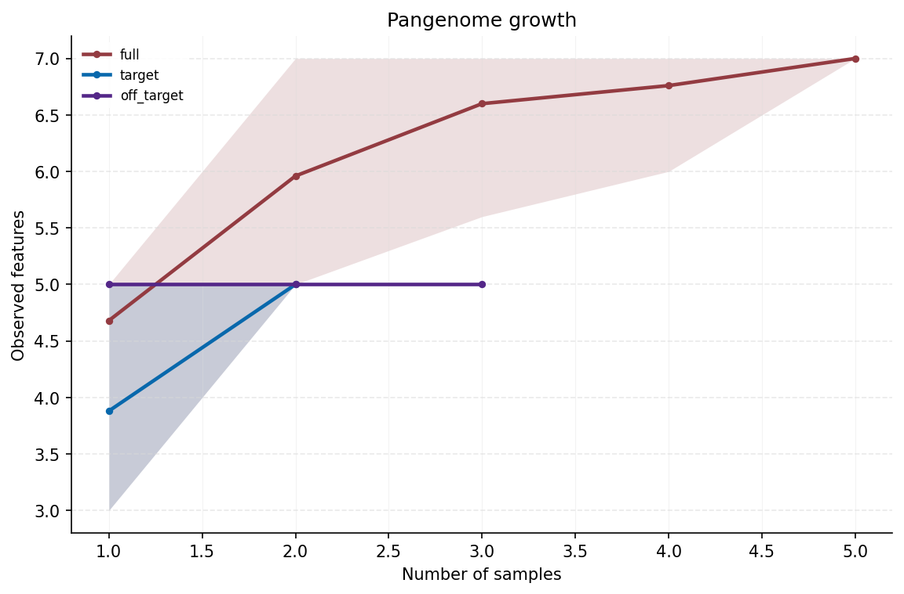

Generated by:

```bash
privy plot \
  --plot-set pangenome \
  --input-dir docs/assets/examples/pangenome-gfa \
  --output-format png
```

**Figure title.** Full, target, and off-target pangenome growth.

**Caption.** Mean number of observed GFA segment features as samples are added
across 25 deterministic permutations. Shaded intervals show the 2.5th to 97.5th
percentile range. The target and off-target curves are computed independently
from the same graph-derived feature matrix.

### Figure: Coverage Distribution

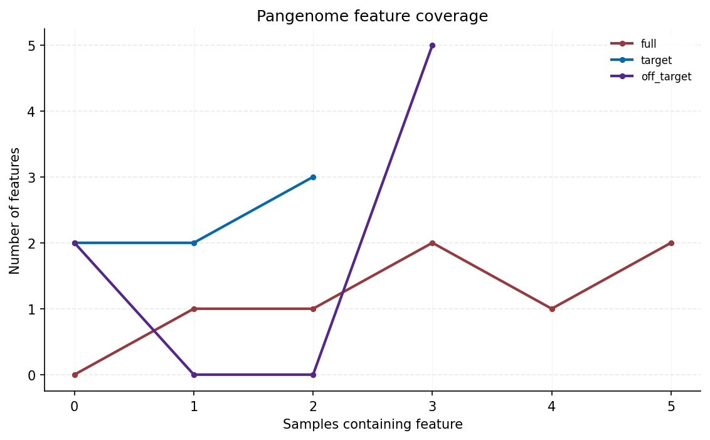

**Figure title.** Feature coverage distribution by group.

**Caption.** Number of features present in 0, 1, 2, or more samples for the
full, target, and off-target groups. In GFA analysis, features are graph
segments; in VCF analysis, features are alternate alleles.

### Figure: Pangenome Composition

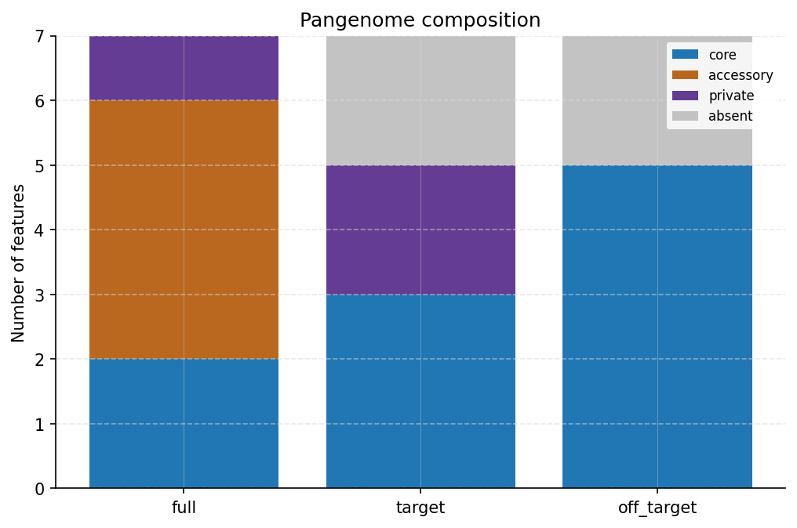

**Figure title.** Core, accessory, private, and absent feature composition.

**Caption.** Feature-category counts for the full cohort, target sub-pangenome,
and off-target sub-pangenome. Categories are assigned independently within each
group, so the same feature can be core in one group and absent in another.

## `privy landscape`

`privy landscape` summarizes a multisample VCF in sliding windows using the
same target/off-target cohort definition used elsewhere in Panex Privus. It is
most useful for quality-control context, chromosome-scale pattern discovery,
and exploratory local background maps.

Example command:

```bash
privy landscape \
  --vcf variants.vcf.gz \
  --targets T1 T2 \
  --off-targets O1 O2 O3 \
  --window-records 200 \
  --step-records 50 \
  --outdir results/landscape/
```

The landscape command writes tables by default. Render landscape figures from
an existing result directory with the `landscape` plot set. This writes one
plot set per contig by default plus `plots/landscape_plot_index.tsv`:

```bash
privy plot \
  --plot-set landscape \
  --input-dir results/landscape/ \
  --output-format png
```

The example landscape figures below were rendered from
`docs/assets/examples/landscape/example_landscape.vcf`, a small synthetic VCF
with target-private windows, missingness spikes, and donor-like local
background blocks.

### Table: Sample Windows (`sample_windows.tsv`)

| window_id | contig | start | end | sample | cohort_role | missing_rate | private_alt_rate | nearest_background | nearest_similarity |
|-----------|--------|-------|-----|--------|-------------|--------------|------------------|--------------------|--------------------|
| `LW00000001` | `chr1` | 99 | 300 | `T1` | `target` | 0.000000 | 1.000000 | `T2` | 1.000000 |
| `LW00000001` | `chr1` | 99 | 300 | `O1` | `off_target` | 0.000000 | 0.000000 | `O2` | 1.000000 |

**Table title.** Per-sample VCF landscape window metrics.

**Caption.** One row is emitted for each sample in each VCF window. Columns
summarize missingness, heterozygosity, non-reference burden, rare/private ALT
burden, median genotype-class frequency, and nearest local background. Intervals
use 0-based half-open coordinates.

### Table: Window Summary (`windows.tsv`)

| window_id | contig | start | end | n_variants | target_mean_missing_rate | target_private_alt_n | top_nearest_background |
|-----------|--------|-------|-----|------------|--------------------------|----------------------|------------------------|
| `LW00000001` | `chr1` | 99 | 300 | 3 | 0.166667 | 3 | `T2` |

**Table title.** Target/off-target landscape summary by VCF window.

**Caption.** Window-level summary of target and off-target missingness,
non-reference burden, private ALT burden, variant density, and the most common
nearest-background assignment.

### Table: VCF Filter Summary (`filter_summary.tsv`)

| metric | value | description |
|--------|-------|-------------|
| `records_seen` | 9 | VCF records encountered before landscape filtering. |
| `records_kept` | 4 | VCF records retained for window construction. |
| `skipped_variant_type` | 1 | Records skipped by `--variant-type`. |

**Table title.** Landscape VCF prefilter audit.

**Caption.** Record-level counts for the filters applied before windows are
constructed. Include this table or its key counts when reporting filtered
SNP-density landscapes, because window density depends directly on the records
retained by the pass/QUAL/type/missingness/carrier filters.

### Table: Local Background Blocks (`background_blocks.tsv`)

| block_id | sample | contig | start | end | n_windows | nearest_background | mean_similarity |
|----------|--------|--------|-------|-----|-----------|--------------------|-----------------|
| `LB00000001` | `T1` | `chr1` | 99 | 800 | 3 | `T2` | 0.944444 |

**Table title.** Local genomic background blocks.

**Caption.** Adjacent windows are merged when a sample's nearest local
background remains the same and passes the similarity threshold. These blocks
are exploratory shared-background segments, not formal recombination-rate map
intervals.

### Table: Candidate Introgression Blocks (`candidate_introgression_blocks.tsv`)

| block_id | sample | contig | start | end | n_windows | candidate_donor | mean_donor_similarity | mean_similarity_delta |
|----------|--------|--------|-------|-----|-----------|-----------------|-----------------------|-----------------------|
| `IB00000001` | `T1` | `chr1` | 1200000 | 1800000 | 4 | `O2` | 0.912500 | 0.181250 |

**Table title.** Candidate donor-like local background blocks.

**Caption.** Target-sample windows are merged when the target is locally
closest to an off-target sample and passes the configured similarity,
missingness, delta, and minimum-window filters. Interpret these rows as
candidate donor-like or introgressed intervals for follow-up, not definitive
introgression calls.

### Figure: Variant Density Profile

**Figure title.** Windowed VCF record density by chromosome.

**Caption.** Line profile of `density_variants_per_kb` from `windows.tsv`.
When `privy landscape` is run with `--variant-type snp` and optional filters
such as `--biallelic-only`, this becomes a filtered SNP-density profile in the
same spirit as VCFtools-style SNP-density bins.

### Figure: Missingness Heatmap

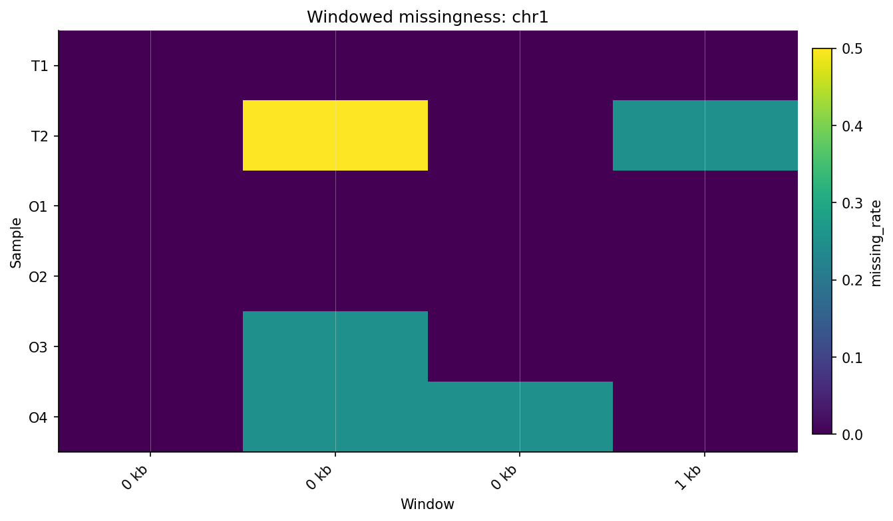

Generated by:

```bash
privy plot \
  --plot-set landscape \
  --input-dir docs/assets/examples/landscape \
  --output-format png
```

**Figure title.** Windowed genotype missingness across samples.

**Caption.** Heatmap of sample-level missing genotype rate in sliding VCF
windows. This figure helps identify chromosome intervals where apparent
private signal may be influenced by missing target or off-target genotypes.

### Figure: Private Burden Heatmap

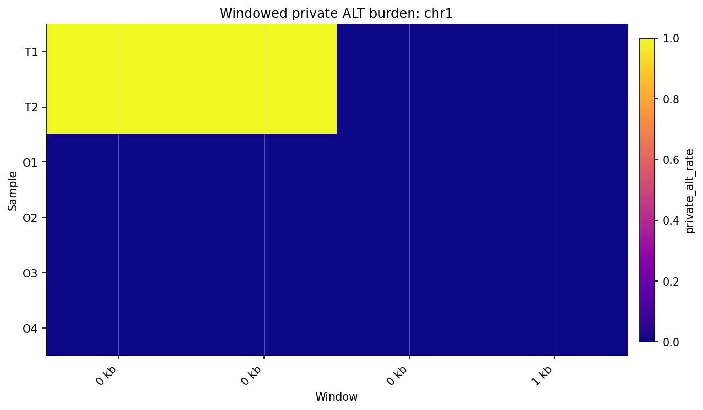

**Figure title.** Windowed private ALT burden across samples.

**Caption.** Heatmap of cohort-private ALT allele events per called record for
each sample. Enriched target-private burden can highlight candidate chromosome
intervals for follow-up. In multiallelic callsets, this is an event rate rather
than a strict 0-to-1 probability.

### Figure: Local Background Map

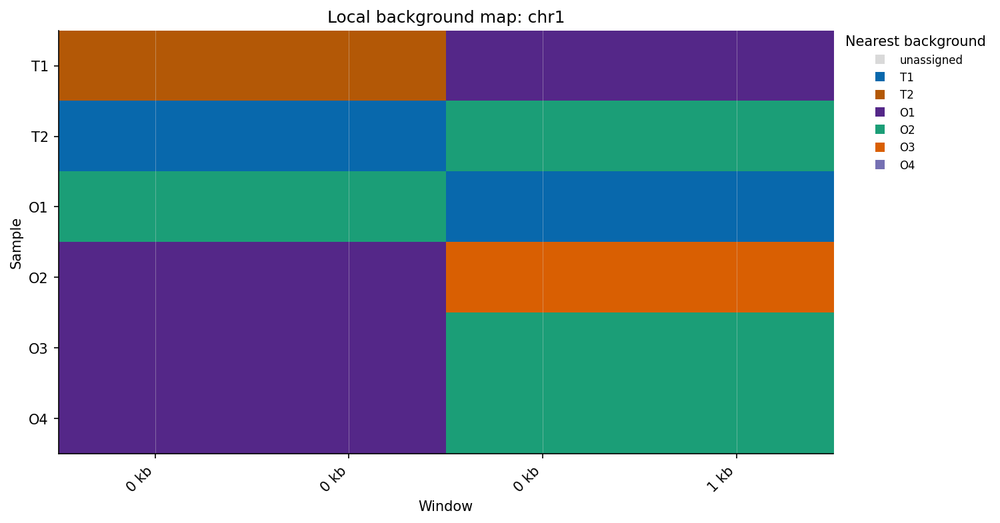

**Figure title.** Local nearest-background assignment by chromosome.

**Caption.** Each sample is plotted across genome windows and colored by the
sample to which it is most locally similar. Long runs of the same color suggest
shared genomic background blocks. Interpret these as exploratory similarity
segments unless a formal cross design or recombination model is supplied.

### Figure: Similarity Cluster Map

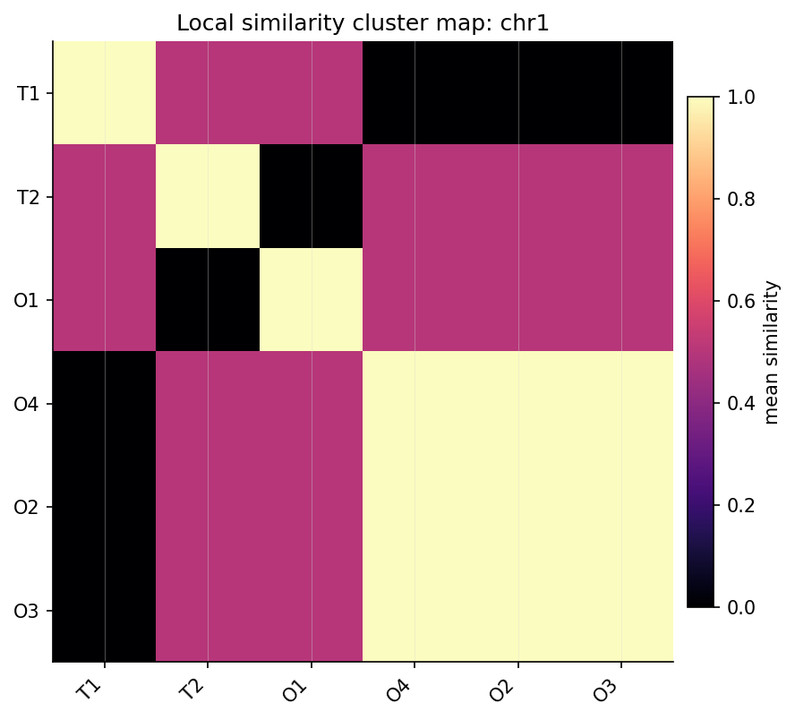

**Figure title.** Clustered local genotype-similarity map.

**Caption.** Mean pairwise genotype similarity across emitted VCF windows,
clustered by sample. This figure summarizes which genomes share local genotype
background across the analyzed windows.

## `privy compare`

`privy compare` reconciles two scan outputs, usually one VCF run and one GFA
run. The goal is not to force the sources to agree perfectly, but to make
agreement, partial agreement, and source-specific discoveries explicit.
For minigraph-cactus GFA output, compare normalizes contig names like
`Sample#0#Gm01` to `Gm01` and uses contained-overlap matching by default so
short graph segments can support longer VCF intervals.

Example command:

```bash
privy compare \
  --hits-a results/vcf/hits.tsv \
  --hits-b results/gfa/hits.tsv \
  --outdir results/compare/
```

### Table: Source Concordance (`compare.tsv`)

| compare_id | locus_id_a | locus_id_b | source_a | source_b | contig | match_class | coordinate_overlap | state_compatibility | comparison_score |
|------------|------------|------------|----------|----------|--------|-------------|--------------------|---------------------|------------------|
| `CMP000001` | `PPX00000001` | `GPX00000002` | `vcf` | `gfa` | `chr1` | `source_specific` | 0.0000 | `True` | 0.3 |
| `CMP000006` | `PPX00000002` | `GPX00000002` | `vcf` | `gfa` | `chr1` | `source_specific` | 0.0000 | `True` | 0.3 |

`coordinate_overlap` reports the score used by the configured overlap mode.
With the default `contained` mode, a short GFA segment fully inside a longer
VCF interval reports `1.0000`.

**Table title.** Concordance between VCF and GFA private-locus scans.

**Caption.** Candidate pairs matched by coordinate overlap and cohort-state
compatibility. Source-specific rows indicate candidates detected in one input
representation but not matched in the other.

### Table: Match-Class Summary (`compare_summary.tsv`)

| match_class | n_loci | pct_total | mean_overlap | mean_score |
|-------------|--------|-----------|--------------|------------|
| `supported` | 0 | 0.0 | `NA` | `NA` |
| `source_specific` | 8 | 100.0 | 0.0000 | 0.3000 |
| `contradicted` | 0 | 0.0 | `NA` | `NA` |

**Table title.** Summary of scan concordance classes.

**Caption.** Counts and percentages of candidate loci by comparison match class.
This table is often easier to report in the main text than the full pairwise
`compare.tsv`.

### Figure: Compare Summary

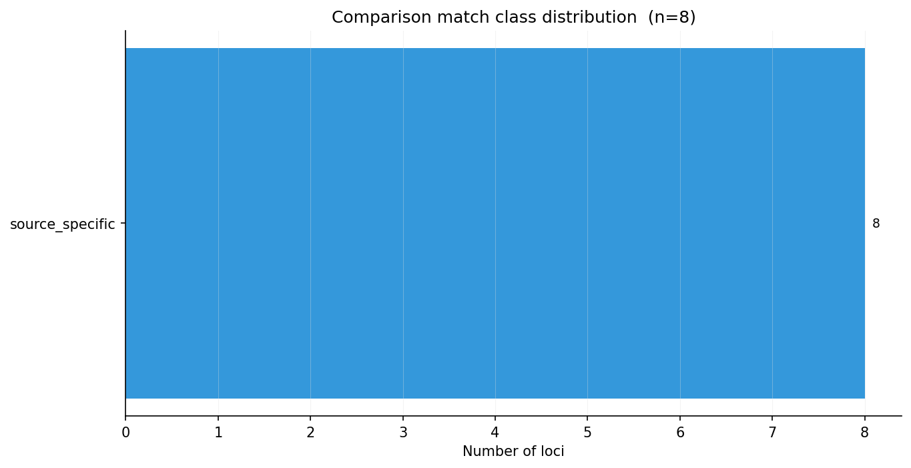

**Figure title.** VCF/GFA match-class distribution.

**Caption.** Distribution of comparison match classes between VCF-derived and
GFA-derived candidate private loci. Source-specific calls can reflect true
representation differences, filtering differences, or incomplete coordinate
overlap between input sources.

## `privy plot`

`privy plot` is the figure-generation command. It turns existing Privy tables
into plots without rerunning the analysis. The `scan` plot set uses scan and
compare tables directly. The `landscape` and `pangenome` plot sets read an
existing result directory and render the figures for that analysis.

Use `--output-format svg` or `--output-format pdf` for publication layout work.
Dense heatmap panels may be embedded as raster image layers inside vector
containers, but axes and text remain vector-editable.

### Plot Set: Scan

Use `--plot-set scan` for candidate-locus, strictness, score, evidence, and
compare-summary figures:

```bash
privy plot \
  --plot-set scan \
  --hits results/vcf/hits.tsv \
  --evidence results/vcf/evidence.tsv \
  --compare results/compare/compare.tsv \
  --plot-type all \
  --outdir results/plots/
```

### Plot Set: Pangenome

Use `--plot-set pangenome` to render pangenome growth, coverage, and composition
figures from a `privy pangenome` output directory:

```bash
privy plot \
  --plot-set pangenome \
  --input-dir results/pangenome/ \
  --output-format pdf
```

### Plot Set: Landscape

Use `--plot-set landscape` to render per-contig heatmaps, local background
maps, and similarity cluster maps from a `privy landscape` output directory:

```bash
privy plot \
  --plot-set landscape \
  --input-dir results/landscape/ \
  --output-format pdf
```

Useful landscape plot controls:

- `--plot-scope chromosome`: one plot set per contig; this is the default
- `--plot-scope genome`: whole-genome overview plots
- `--plot-scope both`: chromosome-level plots plus whole-genome summaries
- `--contig Gm10`: render one chromosome
- `--contigs Gm01,Gm02,Gm03`: render selected chromosomes

### Figure: Locus Panel

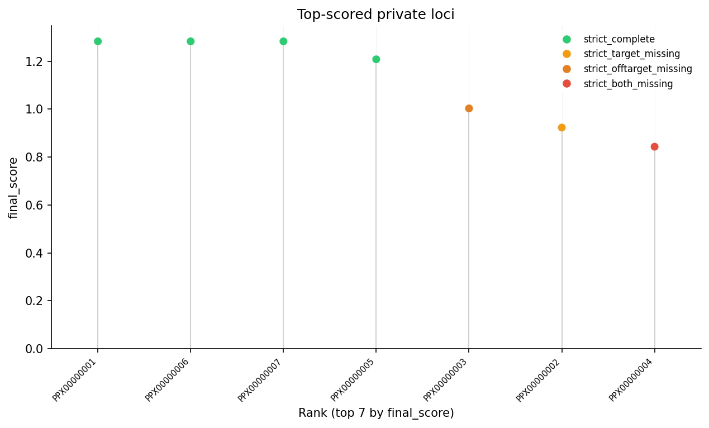

**Figure title.** Top-ranked candidate private loci.

**Caption.** Ranked lollipop plot of candidate loci by `final_score`. Point
color indicates strictness class, allowing high-ranking loci with missingness or
contradiction penalties to be distinguished from strict-complete candidates.

### Figure: Strictness Bar

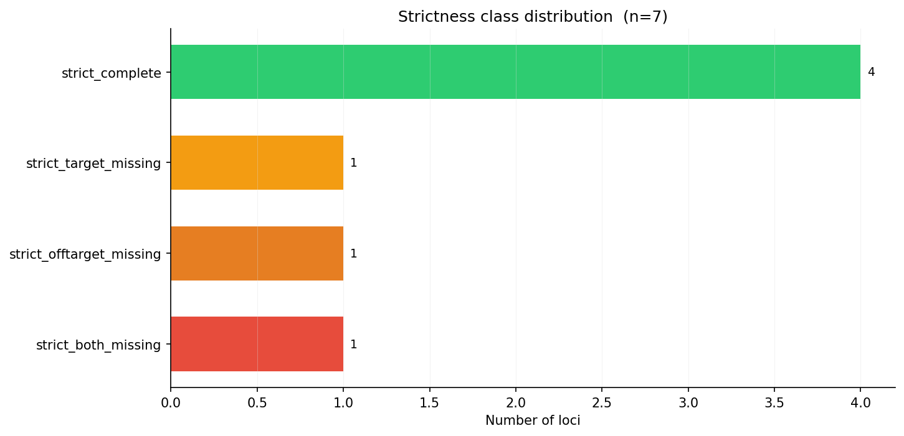

**Figure title.** Strictness-class distribution.

**Caption.** Counts of emitted candidate loci by missingness-aware strictness
class. This plot summarizes how much of the candidate set is strict-complete
versus affected by target missingness, off-target missingness, both missingness,
or relaxed thresholds.

### Figure: Score Distribution

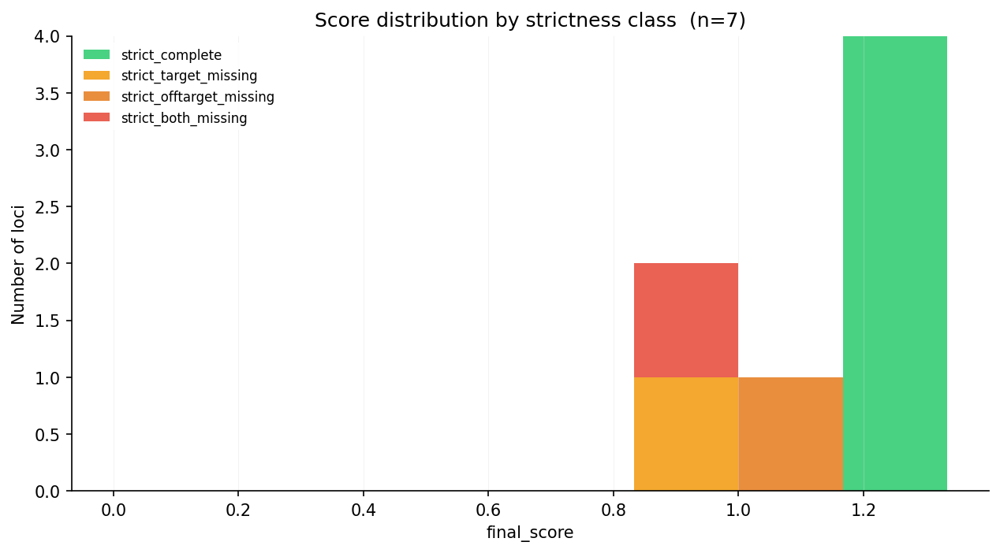

**Figure title.** Candidate score distribution by strictness class.

**Caption.** Distribution of `final_score` values across emitted candidate loci,
colored by strictness class. This plot helps identify score separation,
candidate-ranking tails, and whether missingness penalties dominate the ranking.

### Figure: Support Bar

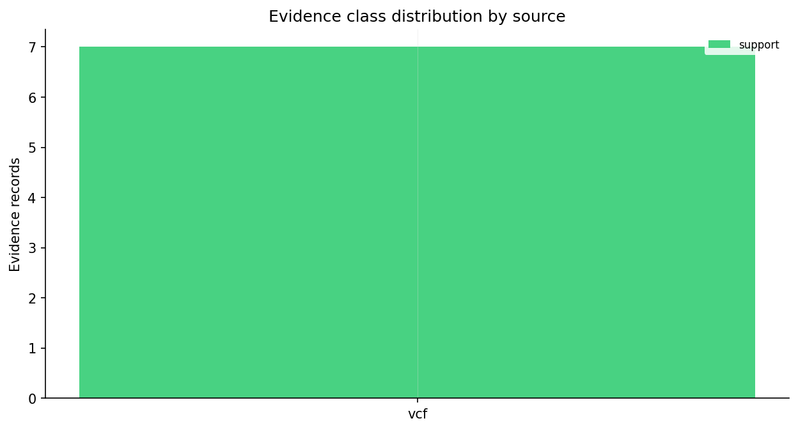

**Figure title.** Evidence class distribution by source.

**Caption.** Counts of support, absence, ambiguity, contradiction, and
uninformative evidence records by source type. When BAM evidence is supplied,
this figure helps summarize read-level support and contradiction across loci.

## `privy report`

`privy report` packages scan outputs into collaborator-friendly Markdown or
HTML. Use it for lab notebooks, supplemental summaries, and review handoffs.
The report is a readable layer over the raw TSVs, not a replacement for them.

Example command:

```bash
privy report \
  --hits results/vcf/hits.tsv \
  --regions results/vcf/regions.tsv \
  --evidence results/vcf/evidence.tsv \
  --qc results/vcf/qc.tsv \
  --compare results/compare/compare.tsv \
  --format both \
  --outdir results/report/
```

### Table: Run Summary (`summary.tsv`)

| metric | value | description |
|--------|-------|-------------|
| `project_name` | `privy_run` | Project name from configuration |
| `n_hits` | 7 | Total loci in `hits.tsv` |
| `n_regions` | 7 | Total candidate regions in `regions.tsv` |
| `top_locus_id` | `PPX00000001` | Locus ID with highest `final_score` |

**Table title.** Panex Privus run summary.

**Caption.** Run-level summary of candidate loci, merged regions, evaluated
records, and top-ranked locus. This table is useful for supplements and
analysis handoffs.

### Table: Ranked Hits (`ranked_hits.tsv`)

| rank | locus_id | contig | start | end | variant_type | strictness_class | final_score |
|------|----------|--------|-------|-----|--------------|------------------|-------------|
| 1 | `PPX00000001` | `chr1` | 99 | 100 | `snp` | `strict_complete` | 1.283333 |
| 2 | `PPX00000006` | `chr1` | 799 | 800 | `snp` | `strict_complete` | 1.283333 |
| 5 | `PPX00000003` | `chr1` | 299 | 300 | `snp` | `strict_offtarget_missing` | 1.003333 |

**Table title.** Ranked candidate private loci.

**Caption.** Top candidate loci with explicit rank values. This table is a
compact supplement-ready view of the highest-priority candidates.

### Table: Strictness Summary (`strictness_summary.tsv`)

| strictness_class | n_loci | pct_hits |
|------------------|--------|----------|
| `strict_complete` | 4 | 57.1 |
| `strict_target_missing` | 1 | 14.3 |
| `strict_offtarget_missing` | 1 | 14.3 |
| `strict_both_missing` | 1 | 14.3 |

**Table title.** Candidate confidence-class summary.

**Caption.** Number and percentage of emitted loci in each missingness-aware
strictness class. Report this table when describing the confidence structure of
the candidate set.

### Table: Support Summary (`support_summary.tsv`)

| source_type | evidence_class | n_records | pct_of_source |
|-------------|----------------|-----------|---------------|
| `vcf` | `support` | 7 | 100.0 |

**Table title.** Evidence class summary by source.

**Caption.** Counts and percentages of evidence classes grouped by source type.
When BAM support is included, this table shows how many read-level observations
support, contradict, or fail to inform candidate loci.

### Table: Contradiction Summary (`contradiction_summary.tsv`)

| metric | value | description |
|--------|-------|-------------|
| `alleles_contradicted` | 1 | Alleles where off-targets also carry the allele |
| `compare_contradicted_loci` | 0 | Loci classified as contradicted in compare output |

**Table title.** Contradiction summary.

**Caption.** Summary of contradictions observed during discovery and comparison.
Use this table to report how often candidate-private signal was challenged by
off-target support or source incompatibility.

## `privy annotate`

`privy annotate` connects candidate loci to GFF3 gene models. Use
`annotated_hits.tsv` when you need to prioritize candidates by gene context.

**Table title.** Annotated target-private candidate loci.

**Caption.** Candidate loci classified by gene-context overlap, such as CDS,
UTR, exonic, intronic, or intergenic. Gene identifiers and strand information
are reported for overlapping genic features.

## `privy export`

`privy export` writes BED or GFF3 files for genome browsers and interval tools.
These files are usually not final manuscript tables, but they are useful for
manual inspection, figure panel preparation, and downstream intersection
analyses.

**Track title.** Panex Privus candidate private loci.

**Caption.** BED or GFF3 track of candidate private loci and merged candidate
regions for genome-browser inspection. BED scores are scaled to the standard
0-1000 range.

## General Interpretation Caveats

- Target-private loci and pangenome features are hypotheses, not causal claims.
- Score rank is a prioritization aid, not a probability of causality.
- GFA segment features and VCF allele features are comparable through the Privy
  matrix model, but they represent different upstream data products.
- Missing samples, graph construction choices, variant normalization, and
  upstream filtering can change core/accessory/private counts.
- Publication figures should report the command, input representation, cohort
  definitions, and important thresholds directly in the caption or methods.
