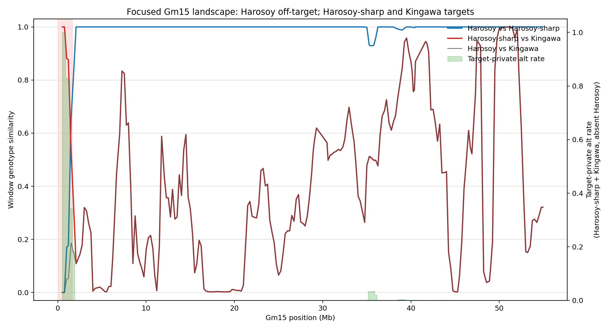

# Gm15 Privy Landscape Interpretation

Analysis date: 2026-05-15  
Input folder: `/Users/rothconrad/OneDrive - University of Georgia/Soybean/Round02/privy_results/run-2`  
Focused biological contrast: off-target `Harosoy`; targets `Harosoy-sharp` and `Kingawa`

Note on names: the result files use the sample name `Kingawa`. I treated the user's `Kingwa`/`Kinga` wording as referring to that same donor accession. I also interpreted "first 400 Mbps" as the first 400 Mbp of Gm15. In these outputs, Gm15 spans only about 55.37 Mb, so the requested interval includes the entire observed chromosome.

## Executive Summary

The most relevant landscape run is `09f_privy_landscape`, because it exactly matches the desired three-genome contrast:

- targets: `Kingawa`, `Harosoy-sharp`
- off-target: `Harosoy`
- windowing: 1 Mbp windows, 250 kbp step
- variant filter: biallelic SNPs only, PASS records, max site missing rate 0.2, minimum 2 alternate-allele carriers

With only three samples, `max_site_missing_rate = 0.2` effectively requires all three samples to be called at retained SNPs. `min_alt_carriers = 2` means retained SNPs are shared by at least two of the three genomes. In this focused run, a "target-private" alternate allele is therefore a high-value pattern: Harosoy-sharp and Kingawa carry the alternate allele, while Harosoy does not.

The main result is a strong donor-like block at the beginning of Gm15:

| interval | evidence | interpretation |
|---:|---|---|
| ~0.008-1.629 Mb | Harosoy-sharp is much closer to Kingawa than to Harosoy; target-private SNP rate is very high | best candidate Kingawa-derived segment on Gm15 |
| ~1.008-2.257 Mb | target-private signal decays across overlapping windows | likely boundary/transition zone, not a precise breakpoint |
| ~35-36.5 Mb | small target-private signal, but Harosoy-sharp remains Harosoy-like | secondary, much weaker candidate; inspect only after the proximal block |
| most of Gm15 | Harosoy-sharp is nearly identical to Harosoy | expected recurrent-parent/background genome |

The conclusion I would carry forward is: if the sharp trichome and disease-resistance phenotype is caused by a Kingawa-derived segment on Gm15, the strongest Privy-supported interval in this run is the proximal Gm15 region, roughly 0-2.3 Mb, with a best-supported donor-like core around 0.008-1.629 Mb.

## Files Produced

I wrote a focused plot and summary tables here:

- `gm15_09f_similarity_private_alt.png`
- `gm15_09f_derived_donor_like_blocks.tsv`
- `gm15_09f_target_private_windows.tsv`
- `gm15_09f_pairwise_similarity_summary.tsv`
- `gm15_09f_nearest_background_summary.tsv`
- `gm15_09f_tool_candidate_introgression_blocks.tsv`
- `run_summary.tsv`

## Which Runs Matter

Several landscape runs exist in the folder. I treated them as exploratory iterations and prioritized the run that matches the biological question.

| run | cohort | windowing/filtering | use in interpretation |
|---|---|---|---|
| `09c_privy_landscape` | broad 12-sample cohort | 200-record windows, all variants | broad context, less directly tied to Harosoy vs Harosoy-sharp vs Kingawa |
| `09d_privy_landscape` | broad 12-sample cohort | 1 Mbp / 250 kbp SNP-filtered windows | useful context for local background among all samples |
| `09e_privy_landscape` | Harosoy, Harosoy-sharp, Kingawa | 200-record windows, all variants, no missingness filter | useful sensitivity check, but inflated by missing calls |
| `09f_privy_landscape` | Harosoy, Harosoy-sharp, Kingawa | 1 Mbp / 250 kbp SNP-filtered windows | primary run for this report |

I did not use `09b_privy_landscape` for biological conclusions because it appears to be an earlier broad record-window run with incomplete/full-similarity differences relative to `09c`. The later focused filtered run, `09f`, is cleaner for this question.

## How To Read The Landscape Output

Privy landscape is not a formal introgression test. It is a windowed descriptive analysis. The most important fields are:

- `similarity`: genotype concordance between two samples within a window, using variants where both samples are called.
- `nearest_background`: the sample with the highest window-level similarity to a given sample.
- `private_alt_n`: for a sample, the number of alternate alleles carried by that sample's cohort and absent from the other cohort.
- `target_private_alt_n`: per window, the number of alternate-allele events carried by at least one target and by no off-target.
- `candidate_introgression_blocks`: target windows where the target sample is closer to an off-target sample than to target samples, merged into blocks.

That last point needs careful interpretation here. In the pedigree you described, Harosoy is the recurrent/background parent and Kingawa is the donor. But in the focused Privy run, Harosoy is the off-target and both Harosoy-sharp and Kingawa are targets. Therefore, Privy's built-in "candidate introgression" blocks mostly identify where Harosoy-sharp looks like Harosoy, not where Harosoy-sharp looks like the donor Kingawa. For your biological question, the more useful signal is:

1. Harosoy-sharp is locally more similar to Kingawa than to Harosoy.
2. Harosoy-sharp and Kingawa share target-private alternate alleles absent from Harosoy.

When both are true in the same interval, that is a much stronger donor-segment candidate than either signal alone.

## Focused Gm15 Results From `09f`

Gm15 contains 219 overlapping 1 Mbp windows in the filtered 09f run, spanning approximately 7,914 bp to 55,349,076 bp. Missingness is zero in these windows after filtering, so the focused SNP signal is not being driven by absent calls.

Pairwise similarity across all Gm15 windows:

| pair | windows | mean similarity | median similarity | min | max |
|---|---:|---:|---:|---:|---:|
| Harosoy vs Harosoy-sharp | 219 | 0.980 | 1.000 | 0.000 | 1.000 |
| Harosoy-sharp vs Kingawa | 219 | 0.403 | 0.356 | 0.002 | 1.000 |
| Harosoy vs Kingawa | 219 | 0.384 | 0.331 | 0.000 | 1.000 |

The chromosome-wide picture is therefore not "Harosoy-sharp is Kingawa-like on Gm15." It is more specific: Harosoy-sharp is Harosoy-like across most of Gm15, with a strong Kingawa-like segment near the beginning.

Nearest-background counts show the same pattern:

| sample | nearest sample pattern on Gm15 |
|---|---|
| Harosoy | nearest to Harosoy-sharp in 219/219 windows |
| Harosoy-sharp | nearest to Harosoy in 215/219 windows; nearest to Kingawa in 4/219 windows |
| Kingawa | nearest to Harosoy in 201/219 windows and Harosoy-sharp in 18/219 windows, because only those two alternatives exist in this focused three-sample run |

The four windows where Harosoy-sharp is nearest to Kingawa are the key windows. They define this donor-like interval:

| derived block | start | end | windows | mean HS-Kingawa similarity | mean HS-Harosoy similarity | mean delta |
|---|---:|---:|---:|---:|---:|---:|
| `DONORLIKE_GM15_01` | 7,914 | 1,628,915 | 4 | 0.939 | 0.086 | 0.853 |

This is a large effect. In the donor-like block, Harosoy-sharp is nearly identical to Kingawa and very unlike Harosoy at the retained SNPs. Outside this block, the usual pattern reverses: Harosoy-sharp and Harosoy are usually identical or nearly identical.

## Target-Private Signal

The target-private signal in `09f` asks a very relevant question: where do Harosoy-sharp and Kingawa share alternate alleles that Harosoy lacks?

Top target-private windows:

| window | interval | SNPs in window | target-private SNPs | target-private rate |
|---|---:|---:|---:|---:|
| `LW00002688` | 0.272-1.229 Mb | 756 | 756 | 1.000 |
| `LW00002687` | 0.008-1.008 Mb | 670 | 670 | 1.000 |
| `LW00002689` | 0.512-1.500 Mb | 1,397 | 1,160 | 0.830 |
| `LW00002690` | 0.760-1.629 Mb | 1,351 | 1,113 | 0.824 |
| `LW00002691` | 1.008-2.008 Mb | 1,721 | 590 | 0.343 |
| `LW00002692` | 1.297-2.257 Mb | 2,303 | 417 | 0.181 |
| `LW00002827` | 35.008-36.007 Mb | 1,040 | 36 | 0.035 |
| `LW00002828` | 35.296-36.254 Mb | 1,046 | 36 | 0.034 |
| `LW00002826` | 34.795-35.757 Mb | 1,075 | 36 | 0.033 |
| `LW00002829` | 35.518-36.508 Mb | 1,794 | 36 | 0.020 |

The proximal Gm15 signal is qualitatively different from the rest of the chromosome. The first four windows have hundreds to more than a thousand target-private SNPs, with rates from 0.824 to 1.000. The secondary 35-36 Mb signal has only 36 target-private SNPs per overlapping window and does not make Harosoy-sharp globally closer to Kingawa than to Harosoy in those windows.

Because the windows overlap, the boundaries should not be treated as breakpoints. A reasonable working interval is 0-2.3 Mb, with the strongest donor-like evidence in the first 1.6 Mb. For breakpoint refinement, extract the raw variants and genotype states across roughly 0-2.5 Mb and look for the transition from target-private to Harosoy-like genotype patterns.

## Built-In Candidate Introgression Blocks

`09f_privy_landscape/candidate_introgression_blocks.tsv` reports three Gm15 blocks, all for Harosoy-sharp with Harosoy as the candidate donor:

| sample | interval | windows | candidate donor | mean donor similarity | mean target similarity | interpretation for this pedigree |
|---|---:|---:|---|---:|---:|---|
| Harosoy-sharp | 1.008-39.758 Mb | 152 | Harosoy | 0.995 | 0.319 | Harosoy-sharp is Harosoy-like background |
| Harosoy-sharp | 39.258-49.998 Mb | 40 | Harosoy | 1.000 | 0.529 | Harosoy-sharp is Harosoy-like background |
| Harosoy-sharp | 51.760-55.349 Mb | 12 | Harosoy | 1.000 | 0.333 | Harosoy-sharp is Harosoy-like background |

These are not wrong, but the label is easy to misread. In this setup, Harosoy is not the donor of the sharp/resistant phenotype; it is the background parent and the only off-target. So these blocks mostly say: "after the proximal donor-like interval, Harosoy-sharp is locally closest to Harosoy." That is exactly what we expect for an introgression line or derivative cultivar.

The important donor signal is actually the reciprocal pattern: Harosoy-sharp closer to Kingawa than to Harosoy. That reciprocal pattern is what produced `DONORLIKE_GM15_01`.

## Broad-Cohort Context From `09d`

The broader filtered SNP run, `09d`, includes all 12 samples. On Gm15 it supports the same background interpretation:

- Harosoy is nearest to Harosoy-sharp in 211/218 windows.
- Harosoy-sharp is nearest to Harosoy in 213/218 windows.
- Kingawa is usually closest to other accessions such as Minsoy, not specifically to Harosoy-sharp, except in a few windows.
- Pairwise mean similarities among the three focal genomes in `09d` are:
  - Harosoy vs Harosoy-sharp: 0.991
  - Harosoy-sharp vs Kingawa: 0.477
  - Harosoy vs Kingawa: 0.471

This says the focused result is not an artifact of excluding the other genomes. Harosoy-sharp really does look like Harosoy across most of Gm15, with only local donor-like departures.

## Scan Outputs: VCF And GFA

The top-level Gm15 scan exports are from the broader `09a_privy_scan` cohort:

- targets: `Kingawa`, `Minsoy`, `Harosoy-sharp`, `Benning-E`, `Clark-sharp`
- off-targets: `PI407020`, `PI507847`, `Pekingv3`, `Benning`, `Clark`, `Harosoy`, `Jackv3`

That scan is not the focused Harosoy vs Harosoy-sharp/Kingawa test. It is still useful as a cross-check, but it should not be overinterpreted for the specific pedigree question.

VCF scan on Gm15:

- 5 hits.
- All are `strict_both_missing`.
- Each has support from only 1 of 5 broad targets.
- Harosoy, Harosoy-sharp, and Kingawa are all uninformative at these 5 hits in `sample_support.tsv`.
- Therefore these VCF scan hits do not directly support the Harosoy-sharp + Kingawa vs Harosoy hypothesis.

GFA scan on Gm15:

- 2,189 graph-region hits.
- All are `strict_both_missing`.
- Every off-target is missing/uninformative for these GFA graph hits, so absence in Harosoy cannot be directly confirmed from the GFA scan table.
- Only one GFA hit supports both Harosoy-sharp and Kingawa: `GPX00040318`, at 1,341,552-1,341,554 bp. Harosoy is uninformative at that hit.
- That one shared Harosoy-sharp/Kingawa GFA hit falls inside the proximal donor-like landscape block, so it is directionally consistent but not independently decisive.

The landscape result is stronger for the focal question because `09f` directly used the three relevant genomes and filtered to called, biallelic SNPs.

## Biological Interpretation

Given the pedigree hypothesis, the desired pattern for a causal donor segment is:

1. Harosoy-sharp and Kingawa share alleles.
2. Harosoy lacks those alleles.
3. The pattern occurs in a coherent local block, not as isolated sites.
4. The same interval makes Harosoy-sharp locally more similar to Kingawa than to Harosoy.

The proximal Gm15 region satisfies all four criteria in the filtered landscape data. It is therefore the highest-priority candidate interval on Gm15 for the donor-derived component of Harosoy-sharp.

Most of Gm15 does not satisfy those criteria. Harosoy-sharp is nearly identical to Harosoy for long stretches, which is expected if Harosoy-sharp is mostly Harosoy background with specific donor introgression. High Harosoy-sharp/Kingawa similarity at later positions should be interpreted cautiously when Harosoy/Harosoy-sharp similarity is also 1.0; that means all three genomes are similar there, not that the interval is donor-specific.

The weaker 35-36 Mb target-private signal is worth keeping in a secondary list, but it does not currently look like the primary donor interval. It may represent a small shared haplotype, a small cluster of informative SNPs, or a windowing artifact.

## Recommended Next Steps

1. Run a focused `privy scan` with only `--targets Harosoy-sharp Kingawa --off-targets Harosoy`, ideally restricted to `Gm15:1-2500000` first, then genome-wide. The existing scan used a broader cohort and misses the specific two-target question.
2. Extract raw genotypes from the VCF across `Gm15:1-2500000` and produce a site-level table with Harosoy, Harosoy-sharp, and Kingawa genotype states. This will refine the approximate donor segment boundaries.
3. Intersect the 0-2.3 Mb candidate interval with gene annotations, resistance-gene annotations, and any known trichome or disease-resistance QTL.
4. Treat `candidate_introgression_blocks.tsv` as "off-target-like background blocks" for this particular focused run, not as donor calls.
5. If the phenotype has already been genetically mapped away from the first 2 Mb of Gm15, then revisit the weaker target-private regions around 35-36.5 Mb and inspect raw genotypes there.

## Bottom Line

The strongest Gm15 signal is a proximal Kingawa-like segment in Harosoy-sharp, approximately 0-2.3 Mb with a high-confidence core across the first ~1.6 Mb. This interval has both the local-background pattern and the target-private allele pattern expected for a Kingawa-derived donor segment in an otherwise Harosoy-like genome.
